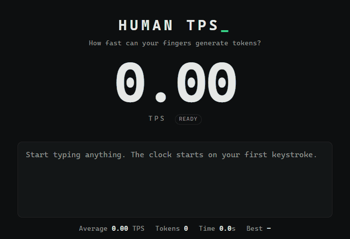

# HUMAN TPS

> How fast can your fingers generate tokens?

Spoiler: a GPU is faster. Much faster.

**▶ Try it: [homoagens.github.io/human-tps](https://homoagens.github.io/human-tps/)**



## How it works

1. Type anything.
2. Every keystroke, your text is split into tokens by a **real tokenizer**, the same one real models use, right in your browser.
   Each token gets its own color, so you can see how a model "reads" your words.
3. The big number is your **live TPS**. Below it: your average, your personal best, and a humbling comparison with real machines
   (*"faster than a 70B model on a laptop CPU · 76× slower than an 8B model on an RTX 4090"*).
4. Hit **Share Result** and challenge your friends.

Pasting is disabled. Humans have to type. 🙂

**There is no AI here.** No model is downloaded, nothing is generated: just your fingers → a tokenizer → a stopwatch.

## Two modes

- **Base**: type and watch the number. No settings.
- **🦙 llama.cpp**: for nerds. A fake `llama-cli` terminal where *you* are the model. Pick one (`qwen3`, `gpt-oss`,
  `deepseek-r1`, `mistral-nemo`) and its real tokenizer counts your tokens. When you stop, you get llama.cpp's actual
  perf output, filled with your very human numbers:

```
llama_perf_context_print:        eval time =   11293.60 ms /    22 runs   (  513.35 ms per token,     1.95 tokens per second)
```

## Run it yourself

Plain static files, no build step. From the repo folder:

```bash
python -m http.server 8000
```

Then open <http://localhost:8000>. (Opening `index.html` directly as a file mostly works, but llama.cpp mode needs a server.)

## Contributing

Fork it, break it, make it funnier. Pull requests welcome! House rules: no frameworks, no build step, no backend,
no tracking, and it has to stay simple. For big ideas, open an issue first.

## License

[MIT](LICENSE). The vendored tokenizers in `vendor/` keep their own licenses (each folder includes its LICENSE).

Powered by [homoagens](https://github.com/homoagens)
